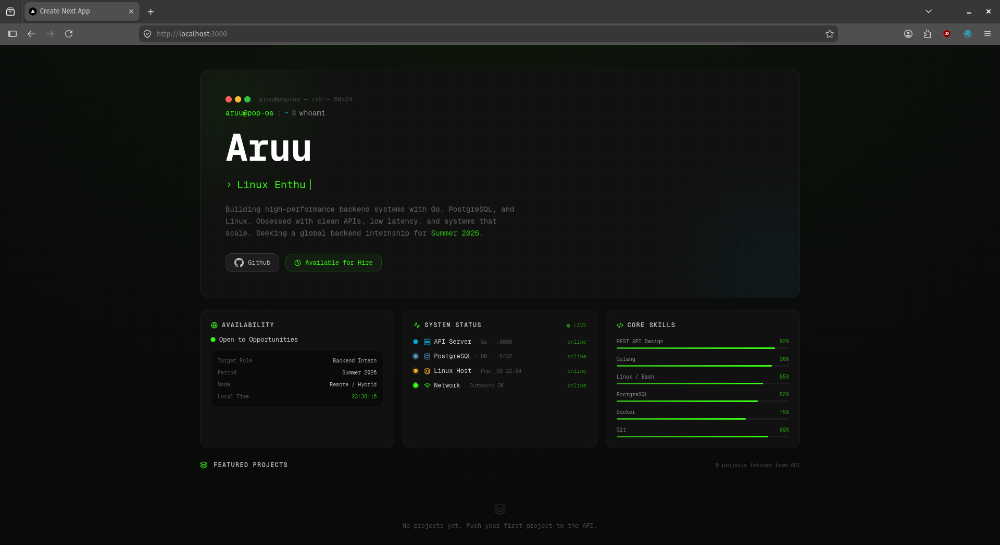
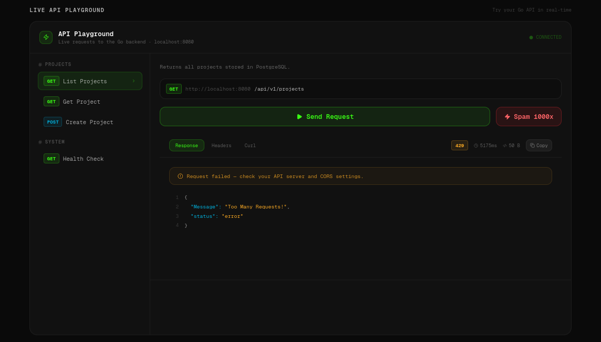
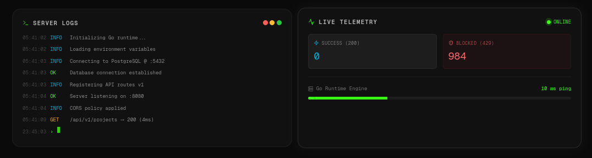

# Portfolio & Live API Playground

A full-stack developer portfolio designed not just to display projects, but to actively demonstrate backend engineering capabilities. It features an interactive REST API playground, real-time server telemetry, and custom-built middleware, all fully containerized.


> **Note:** Please replace the path above with a screenshot of your actual website's hero section or main dashboard.

## 🚀 Key Features

*   **Live API Playground:** An interactive UI allowing visitors to execute live HTTP requests (GET, POST) directly to the backend server.
*   **Real-time Server Telemetry:** Visual dashboard displaying active server ping, successful request counts (HTTP 200), and blocked request counts (HTTP 429).
*   **Custom Rate Limiting Middleware:** Built entirely from scratch using Go's standard library (`net/http`) and the Token Bucket algorithm to mitigate spam and simulated DDoS attacks.
*   **Fully Containerized:** Isolated environments for the frontend, backend, and database using Docker & Docker Compose for seamless deployment.
*   **Secure & Optimized:** Implements CORS, environment-based configuration, and connection pooling for PostgreSQL.

## 🛠️ Technology Stack

**Backend**
*   **Language:** Go (Golang)
*   **Framework:** Standard Library (`net/http`)
*   **Database:** PostgreSQL 15
*   **Architecture:** Clean Architecture (Handler, Usecase, Repository)

**Frontend**
*   **Framework:** Next.js (App Router)
*   **Language:** TypeScript
*   **Styling:** Tailwind CSS & Framer Motion
*   **Integration:** Fetch API with Custom Event Listeners for Telemetry

**Infrastructure**
*   Docker & Docker Compose

## 📸 System Showcase

### 1. API Playground & Telemetry

> Visitors can test the API directly. The telemetry card tracks the health and traffic of the Go server in real-time.

### 2. Rate Limiting in Action

> Demonstration of the backend successfully blocking excessive traffic (HTTP 429 Too Many Requests) when the "Spam 50x" function is triggered.

## ⚙️ Local Development & Installation

Ensure you have [Docker](https://www.docker.com/) and Docker Compose installed on your machine.

1. **Clone the repository:**
   ```bash
   git clone [https://github.com/yourusername/web_porto.git](https://github.com/yourusername/web_porto.git)
   cd web_porto

2. **Environment Setup:**
    Create .env files in both the /backend and /frontend directories (refer to .env.example if available).

    Example Backend .env:
    Code snippet

    PORT=8080
    DB_USER=postgres
    DB_PASSWORD=your_secure_password
    DB_NAME=porto_db
    DB_HOST=db

 3. **Build and Run with Docker Compose:**
    ```bash
    sudo docker-compose up -d --build

  4. Access the Application:

        Frontend (Next.js): http://localhost:3000
        Backend API (Go): http://localhost:8080/api/v1

📂 Project Structure
```Plaintext
.
├── backend/
│   ├── cmd/                # Entry point (main.go)
│   ├── internal/           # Private application and library code
│   │   ├── handler/        # HTTP handlers
│   │   ├── middleware/     # Custom middlewares (CORS, Rate Limiter, Logger)
│   │   ├── repository/     # Database operations
│   │   └── usecase/        # Business logic
│   └── pkg/                # Publicly shared packages (e.g., database connection)
├── frontend/
│   ├── app/                # Next.js App Router components & pages
│   ├── components/         # Reusable UI components (Widgets, ApiPlayground)
│   └── lib/                # API execution logic
└── docker-compose.yml      # Container orchestration
